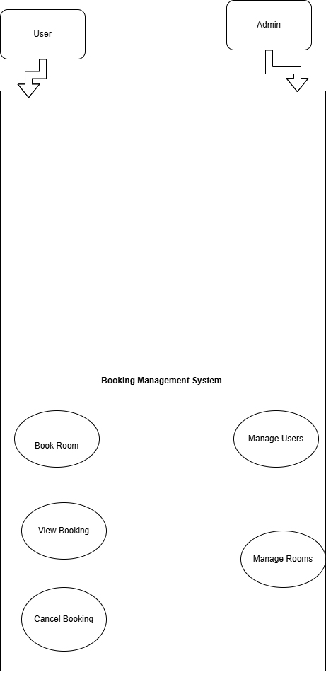

# requirement-analysis
The Requirement Analysis Project builds a solid foundation for software development by documenting and analyzing requirements for a booking management system. It guides learners through real-world tasks to create clear, structured, and precise requirements that ensure successful project execution.
# Requirement Analysis in Software Development

## Introduction
This repository explores the concept of **Requirement Analysis** within the Software Development Life Cycle (SDLC).  
It aims to provide learners with a clear understanding of how software requirements are gathered, analyzed, documented, and validated before the actual development begins.  

The contents of this repository cover:
- Definition and importance of Requirement Analysis
- Key activities involved
- Types of requirements
- Use case diagrams
- Acceptance criteria examples
## What is Requirement Analysis?

**Requirement Analysis** is the process of identifying, understanding, and documenting what a software system should do.  
It involves gathering information from stakeholders such as clients, users, and developers to define the system's goals and features clearly.

This process ensures that the development team and the client have a shared understanding of what needs to be built.  
It is a critical step in the **Software Development Life Cycle (SDLC)** because it forms the foundation for design, coding, and testing.
## Why is Requirement Analysis Important?

Requirement Analysis is crucial in software development for several reasons:

1. **Prevents Miscommunication**  
   It ensures all stakeholders have a clear, common understanding of what the system should do, reducing confusion and rework.

2. **Saves Time and Cost**  
   Identifying requirements early avoids costly changes later during design or implementation.

3. **Improves Product Quality**  
   Well-defined requirements lead to better designs and more accurate testing, resulting in a higher-quality software product.
## Key Activities in Requirement Analysis

The Requirement Analysis phase includes several key activities:

- **Requirement Gathering:**  
  Collecting information from stakeholders through interviews, questionnaires, and observations.

- **Requirement Elicitation:**  
  Extracting detailed requirements using techniques like brainstorming, workshops, or prototyping.

- **Requirement Documentation:**  
  Recording the collected requirements clearly and formally, usually in a Software Requirements Specification (SRS) document.

- **Requirement Analysis and Modeling:**  
  Analyzing requirements for clarity, completeness, and feasibility. Modeling tools like flowcharts and UML diagrams are used to visualize them.

- **Requirement Validation:**  
  Ensuring the documented requirements accurately reflect stakeholder needs and are testable.
## Types of Requirements

### Functional Requirements
These describe what the system should do — the specific functions or features.

**Examples (for a Booking Management System):**
- Users can create, view, and cancel bookings.
- The system should allow searching available rooms by date and location.
- An admin can manage user accounts and booking data.

### Non-Functional Requirements
These define how the system performs its functions — focusing on quality attributes like performance or security.

**Examples:**
- The system should load search results within 3 seconds.
- The application must handle up to 500 concurrent users.
- User data must be encrypted and securely stored.
alx-booking-uc.png
## Use Case Diagrams

A **Use Case Diagram** visually represents the interactions between system users (actors) and the system’s use cases.  
It helps clarify the system’s scope and shows how users engage with its functions.

Below is a Use Case Diagram for the **Booking Management System**:

## Acceptance Criteria

**Acceptance Criteria** define the conditions that must be met for a feature to be considered complete and acceptable by the client or product owner.  
They help ensure that requirements are clear, measurable, and testable.

### Importance
- They provide a checklist for developers and testers.
- They prevent misunderstandings between clients and developers.
- They ensure the software meets business expectations.

### Example (Checkout Feature)

**Feature:** Checkout in Booking System  
**Acceptance Criteria:**
1. User must be able to view total price before confirming booking.  
2. Payment must be processed securely through the integrated gateway.  
3. Confirmation message and booking ID must display upon successful payment.  
4. User receives a confirmation email after booking.
